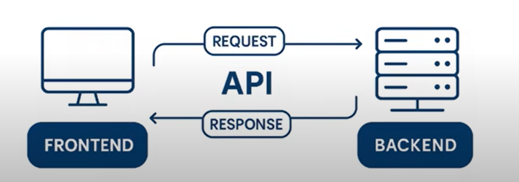
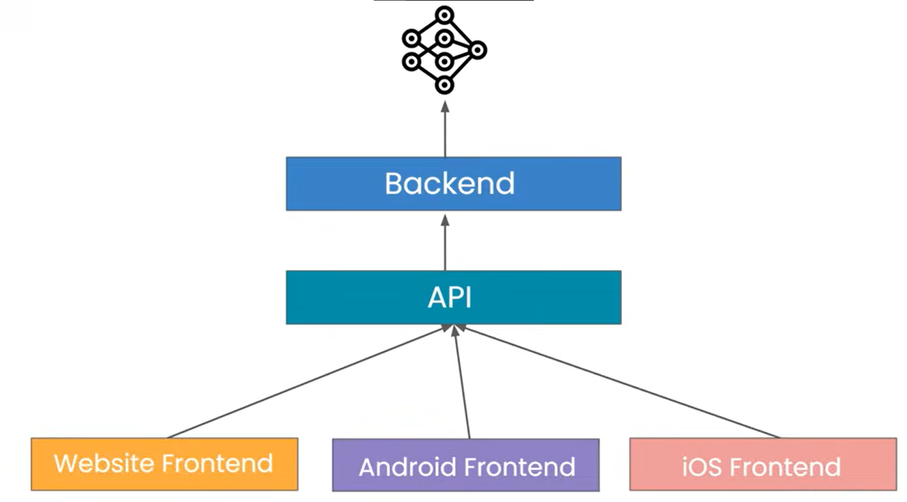
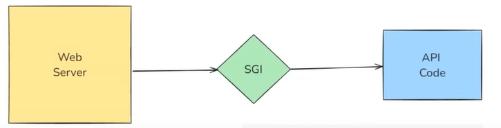
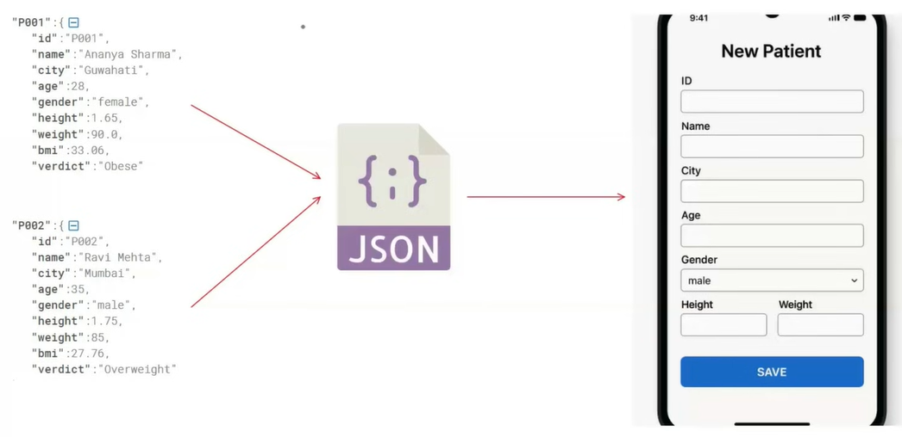
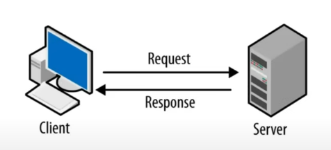

# 🧩 What is an API?
An API (Application Programming Interface) is a set of rules and protocols that allow two software components—like frontend and backend—to communicate with each other.s
Real-Life Analogy:
Think of an API as a waiter in a restaurant:
The customer (frontend) places an order.
The waiter (API) communicates this to the kitchen (backend).
The kitchen prepares the dish (response) and the waiter delivers it back to the customer.




## ⚡ Why FastAPI and Not Other Frameworks?
Most companies prefer FastAPI for deploying ML models due to its:
Speed (based on asynchronous programming)
Easy integration with Python-based ML workflows
Automatic generation of interactive API documentation (via Swagger UI)
Built-in validation and error handling using pydantic
Fast development and testing processs
All these benefits make FastAPI ideal for modern, scalable ML applications.

## ❓ Why Do We Need APIs?
Let’s take the example of IRCTC (Indian Railway Catering and Tourism Corporation):
Initially, when everything was built as a monolithic application (single application i.e. frontend and backend code in single directory thus enabling direct communication without API), both frontend and backend code existed within a single structure. In such a setup:
- Frontend directly called backend functions to fetch data from the database.
- Communication between frontend and backend was internal and didn’t require APIs.
- However, this tight coupling meant that a failure in one component could affect the entire system.

## 🤖 So, why move to APIs?
Imagine third-party services like MakeMyTrip, Yatra, or Ixigo want real-time train data from IRCTC for trains between two locations and agreed to pay for it. With a monolithic setup:
- You can't give direct access to your internal backend.
- You can’t expose your database either.
Solution: Add an API layer on top of your backend.
- This API can be accessed by any external system using defined endpoints.
- The frontend and other clients (like mobile apps, partner websites, etc.) can now fetch data through these APIs using HTTP/HTTPS protocols. All the frontend uses same backend and database instead of multiple Monolithic Architectures
- You can enforce security, rate limits, access control, and other constraints on these APIs.
- The response from the API come in a specific format called json (universal data format) enabling all the backend written in different languages to communicate easily like makemytrip, yatra and ixigo etc. may be using python, java and php backend respectively.
- Here, Backend and frontend are not coupled like in Monolithic Architecture.

## 🌐 Why APIs Are Needed for ML Models + Why FastAPI?
APIs are essential for making machine learning models accessible and usable across various platforms. This write-up covers the importance of APIs, why FastAPI is often chosen for ML deployment, and a simple analogy to help understand APIs in real-world scenarios.
To make a machine learning model accessible to the rest of the world, an API (Application Programming Interface) is required. Machine learning models often rely on structured data or predictions, and users (clients or customers) want to access these services through a backend system.
APIs act as bridges that allow your ML model (hosted on a server) to be used on various platforms, such as websites, mobile apps, or even other services.
For example, OpenAI's ChatGPT model is accessible through an API—developers can integrate it into their own websites or applications seamlessly.



## What is fastAPI?
FastAPI is a modern, high-performance web framework for building APIs with Python. It is made using two most popular libraries Starlette (manages how your API receives requests and sends back responses) and pydantic(data validation library to check if the data incoming into your API is correct and in the right format).

## Objectives of FastAPI?
- Fast to run and handle concurrent users
- Fast to code the API

## Why FastAPI is so fast?
- When we deploy ML model on AWS, It has two components.
Web Server: Listen http requests that are coming to the port of AWS machine on which the API is running.
Example of http request received by the Web Server.
```bash
    POST /predict HTTP/1.1
    Host: api.example.com
    Content-Type: application/json
    Content-Length: 45
    {
    "feature1": 5.2,
    "feature2": 3.1
    }
```
- API Code: It contains number of future values model will get, how to load the model, call the function to generate the prediction.
Example of Output of the model
```bash
"prediction:8.3"
```

- SGI(Server Gateway Interface): convert http request into python understandable format.
Example of output of http request to be passed to the API Code.
```bash
Request.method --> "POST"
Request.url --> "/predict"
Request.json()->{"feature1": 5.2, "feature2": 3.1}
```
- Example of Response after converting into http understandable format by the SGI.
```bash
HTTP/1.1 200 OK
Content-Type: application/json
{
"prediction": 8.3
}
```


## Flask VS FastAPI:
In Flask, we use WSGI(Web Server Gateway Interface) by the name of Gunicorn as SGI which is Synchronous Endpoint. Its synchronous nature (one request at a time) and blocking architecture can lead to slower request processing and scalability challenges. It uses Werkzeug.
```python
@app.route("/predict", methods=["POST"])
def predict():
    json_data = request.get_json()
    data = InputData(**json_data)
    result = predict_sync(data)
    return jsonify(result)
```
In FastAPI, we use ASGI(Asynchronous Server Gateway Interface) by the name of uvicorn as SGI which is Asynchronous Endpoint. It can process multiple request concurrently and provide high performance. It uses Starlette.
Here, if predict_async(data) will take longer time and new request came then function predict will process the next one without waiting for the output of the first one.
```python
@app.post("/predict")
async def predict(data: InputData):
    result = await predict_async(data)
    return result
```

## Why FastAPI is fast to code?
1. Automatic Input Validation using pydantic
2. Auto-Generated Interactive Documentation
3. Seamless Integration with Modern Ecosystem (ML/DL libraries, OAuth, JWT, SQL Alchemy, Docker, Kubernetes etc.)

## Example of Basic FastAPI:
```python
from fastapi import FastAPI

app = FastAPI()

@app.get("/")
def hello():
    return {"message": "Hello, World!"}

@app.get("/greet/{name}")
def greet(name: str):
    return {"message": f"Hello, {name}!"}
```
- To run the FastAPI you need to install the required libraries:
```bash
pip install fastapi uvicorn pydantic
```
- To run the app, use the command in the terminal instead of running the python file:
```bash
uvicorn main:app --reload
```
- **Reload** will automatically reload the server when you make changes to the code.
- http://127.0.0.1:8000/docs to see the **API documentation** where 8000 is the **port number** and **127.0.0.1** is the IP address.

## ML model with FastAPI
- An website that helps patient to maintain patient records to treat the patient better as physical documents can be lost, miss-place etc. It allows you to add new customer profile(create), view(one individual and all patient), update and delete the existing customers. **Here, we are storing the customer profile in a json but ideally one should store in a database.**
- **endpoints** in the example:
    - /create
    - /view
    - /view/patient_id
    - /update/patient_id
    - /delete/polient_id
- **Http Methods**: In website the software is installed in **server** and accessed by the **client** on other machine using http protocol.
There are two types of websites(softwares):
1. **Static**: very less interaction between user and client like calender, Blog, Government Website and clock.
2. **Dynamic**: too much interaction between user and client like MSExcel, YouTube etc.
- Four operations(**CRUD**) performed in Dynamic Software are:

**Create**: **POST**
```python
@app.post('/create')
def create_patient(patient: Patient):
    # load existing data
    data = load_data()
    # check if the patient already exists
    if patient.id in data:
        raise HTTPException(status_code=400, detail='Patient already exists')
    # new patient add to the database
    data[patient.id] = patient.model_dump(exclude=['id'])
    # save into the json file
    save_data(data)
    return JSONResponse(status_code=201, content={'message':'patient created successfully'})
```
**Retrieve**: **GET**
```python
@app.get("/view")
def view():
    data = load_data()
    return data
```
**Update**: **PUTs**
```python
@app.put('/edit/{patient_id}')
def update_patient(patient_id: str, patient_update: PatientUpdate):
    data = load_data()
    if patient_id not in data:
        raise HTTPException(status_code=404, detail='Patient not found')
    existing_patient_info = data[patient_id]
    updated_patient_info = patient_update.model_dump(exclude_unset=True)
    for key, value in updated_patient_info.items():
        existing_patient_info[key] = value
    #existing_patient_info -> pydantic object -> updated bmi + verdict
    existing_patient_info['id'] = patient_id
    patient_pydandic_obj = Patient(**existing_patient_info)
    #-> pydantic object -> dict
    existing_patient_info = patient_pydandic_obj.model_dump(exclude='id')
    # add this dict to data
    data[patient_id] = existing_patient_info
    # save data
    save_data(data)
    return JSONResponse(status_code=200, content={'message':'patient updated'})
```
**Delete**: **DELETE**
```python
@app.delete('/delete/{patient_id}')
def delete_patient(patient_id: str):
    # load data
    data = load_data()
    if patient_id not in data:
        raise HTTPException(status_code=404, detail='Patient not found')
    del data[patient_id]
    save_data(data)
    return JSONResponse(status_code=200, content={'message':'patient deleted'})
```


## Path Parameters: 
They are dynamic segments of a URL path used to identify a specific resource. The Path() furiction in FastAPI is used to provide metadata, validation rules, and documentation hints for path parameters in your API endpoints.
Example:
    Title
    Description
    Example
    ge(greater than equal to), gt, le, It
    Min_length
    Max_length
    regex
    ... (means required)

**HTTP status codes** are 3-digit numbers returned by a web server (like FastAPI) to indicate the result of a client's request (like from a browser or API consumer).



They help the client (browser, frontend, mobile app, etc.) understand:
    - whether the request was successful,
    - whether something went wrong,
    - and what kind of issue occurred (if any).

| Code Range | Meaning        | Description                                              |
|------------|----------------|----------------------------------------------------------|
| `2xx`      | Success        | The request was successfully received and processed      |
| `3xx`      | Redirection    | Further action needs to be taken (e.g., redirect)        |
| `4xx`      | Client Error   | Something is wrong with the request from the client      |
| `5xx`      | Server Error   | Something went wrong on the server side                  |

| Status Code | Meaning                   | When It Occurs                                      |
|-------------|---------------------------|-----------------------------------------------------|
| `200 OK`    | Standard success          | A GET or POST succeeded                             |
| `201 Created` | Resource created        | After a POST that creates something                 |
| `204 No Content` | Success, no data     | After a DELETE request                              |
| `400 Bad Request` | Malformed request   | Missing field, wrong data type                      |
| `401 Unauthorized` | Auth required      | No or invalid authentication; login required        |
| `403 Forbidden` | Permission denied     | Logged in but not allowed                           |
| `404 Not Found` | Resource missing      | Patient ID not in database                          |
| `500 Internal Server Error` | Server failure | Something broke on the server                  |
| `502 Bad Gateway` | Gateway failure     | Gateway (e.g., Nginx) failed to reach backend       |
| `503 Service Unavailable` | Server down | Server is down or overloaded                        |

**HTTPException** is a special built-in exception in FastAPI used to return custom HTTP error responses when something goes wrong in your API.
Instead of returning a normal JSON or crashing the server, you can gracefully raise an error with:
- a proper HTTP status code (like 404, 400, 403, etc.)
- a custom error message
- (optional) extra headers

Example of HTTPException, HTTP status codes and Path Parameters.
```python
@app.get('/patient/{patient_id}')
def view_patient(patient_id: str = Path(..., description='ID of the patient in the DB', example='P001')):
    # load all the patients
    data = load_data()
    if patient_id in data:
        return data[patient_id]
    raise HTTPException(status_code=404, detail='Patient not found')
```

**Query Parameter** are optional key-value pairs appended to the end of a URL, used to pass additional data to the server in an HTTP request. They are typically employed for operations like filtering, sorting, searching, and pagination, without altering the endpoint path itself.
```bash
/patients?city=Delhi&sort_by=age
```
- The ? marks the start of query parameters.
- Each parameter is a key-value pair: `key=value`
- Multiple parameters are separated by `&`
In this case:
    - `city=Delhi` is a query parameter for filtering
    - `sort_by=age` is a query parameter for sorting

**Query()** is a utility function provided by FastAPI to declare, validate, and document query parameters in your API endpoints.

It allows you to:
    - Set default values
    - Enforce validation rules
    - Add metadata like description, title, examples

| Parameter/Option      | Description                                |
|-----------------------|--------------------------------------------|
| `default`             | Set default value (e.g., `Query(e)`)       |
| `title`               | Displayed in API documentation             |
| `description`         | Detailed explanation in Swagger UI         |
| `example` / `examples`| Provide sample input(s)                    |
| `min_length`, `max_length` | Validate string length                |
| `ge`, `gt`, `le`, `lt`| Validate numeric bounds                    |
| `regex`               | Pattern match for string validation        |

```python
@app.get('/sort')
def sort_patients(sort_by: str = Query(..., description='Sort on the basis of height, weight or bmi'), 
                    order: str = Query('asc', description='sort in asc or desc order')):
    valid_fields = ['height', 'weight', 'bmi']
    if sort_by not in valid_fields:
        raise HTTPException(status_code=400, detail=f'Invalid field select from {valid_fields}')
    if order not in ['asc', 'desc']:
        raise HTTPException(status_code=400, detail='Invalid order select between asc and desc')
    data = load_data()
    sort_order = True if order=='desc' else False
    sorted_data = sorted(data.values(), key=lambda x: x.get(sort_by, 0), reverse=sort_order)
    return sorted_data
```

A **request body** is the portion of an HTTP request that contains data sent by the client to the server. It is typically used in HTTP methods such as POST, or PUT to transmit structured data (e.g., JSON, XML, form-data) for the purpose of creating or updating resources on the server. The server parses the request body to extract the necessary information and perform the intended
operation.

---

# What is Pydantic?
Pydantic is a Python library used for data validation and settings management using Python type annotations. It enforces type hints at runtime and provides user-friendly errors when data is invalid. It is widely used with FastAPI to validate request and response data automatically and ensure clean, well-defined schemas.

## Pydantic Model and its working :
1. Define a Pydantic model that represents the ideal schema of the data.
- This includes the expected fields, their types, and any validation constraints (e.g., gt=0 for positive numbers).
2. Instantiate the model with raw input data (usually a dictionary or JSON-like structure).
- Pydantic will automatically validate the data and coerce it into the correct Python types (if possible).
- If the data doesn't meet the model's requirements, Pydantic raises a ValidationError.
3. Pass the validated model object to functions or use it throughout your codebase.
- This ensures that every part of your program works with clean, type-safe, and logically valid data.
NOTE: Use Pydantic v2 as it is significantly faster and more feature-rich compared to v1.

## Response Model in FastAPI
In FastAPI, a Response Model defines the structure of the data that your API endpoint will return. It helps in:
1. Generating clean API docs (/docs).
2. Validating output (so your API doesn't return malformed responses).
3. Filtering out unnecessary or extra data from the response.
NOTE: Just like we validate user input, we also validate model output sent to the user using the Response Model.

## Pydantic Components and Keywords:

**BaseModel** : The base class for all Pydantic models. Used to define schema and validation logic.

**Nested Models** : 
If you have complex data structures, you can define nested Pydantic models to represent them. TThis provides:
- Better organization of related data
- Reusability of common structures
- Improved readability
- Validation of deeply structured or related data. 

```python
    # Example of Base Model and Nested model to validate address.
    class Adddress(BaseModel):
        city: Annotated[Optional[str], Field(default='Aya Nagar', description='City of the user')]
        state: Annotated[Optional[str], Field(default='New Delhi', description='State of the user')]
        pin: Annotated[Optional[int], Field(default=110047, description='PIN of the user')]

    class UserInput(BaseModel):
        .
        .
        .
        Adddress: Optional[Adddress] 
```

**Annotated** : Combines a type annotation with metadata (e.g., Field for validation and documentation).
```python
    age: Annotated[int, Field(gt=0, lt=120, description="Age of the user")]
```

**Optional** : Marks a field as not required. Fields are required by default unless a default is provided or wrapped in Optional.
```python
    from typing import Optional
    email: Optional[str]
```

**Field** : Used with Annotated to provide validation and documentation metadata.
```python
    age: Annotated[int, Field(gt=0, description="Age must be positive")]
```

**Literal** : Used to restrict a value to a fixed set of choices.
```python
    from typing import Literal
    status: Literal["active", "inactive"]
```

**EmailStr** : Built-in type that validates that the value is a valid email address.

**AnyUrl** : Built-in type that validates that the value is a valid URL.

**List** : Used to define a list of a specific type.
```python
    from typing import List
    allergies: List[str]  # A list of strings
```

**Dict** : Validates dictionary keys and values.
```python
    from typing import Dict
    contact_details: Dict[str, str]
```

**strict** : Pydantic automatically converts '30' to 30. Using strict=True avoids automatic type conversion.
```python
        weight: Annotated[float, Field(..., gt=0, strict=True, description='Weight of the user')]
```

**computed_field** : Used to define fields computed from other fields. The name of the new computed field is same as the function name. Here, it is bmi.
```python
    @computed_field
    @property
    def bmi(self) -> float:
        return round(self.weight/(self.height**2),2)
```

**field_validator** : Apply custom validation to a field.
```python
    # Example of applying customer validation on emaild fields to be from one specific companies.
    @field_validator('email')
        @classmethod
        def validate_email(cls, v: EmailStr) -> EmailStr:
            valid_domains = ['hdfc.com','icici.com','sbi.com','axisbank.com','canarabank.com']
            domain_name = v.split('@')[-1]
            if domain_name not in valid_domains:
                raise ValueError(f"Email domain must be one of {valid_domains}")
            return v.strip().lower()
```

**model_validator** : Used to perform validation on whole model after all fields are validated.
```python
    @model_validator(mode='after')
    def age_income_validator(cls,model):
        if model.age > 60 and model.income_lpa < 1000000:
            raise ValueError('Client above 60 years must have income more than 10 lpa')
        return model
```

**mode** : Controls the timing of validation in field_validator.
- mode='before': Runs before type coercion(output will be of before field validation. If input is '30' then output will be error of '< is not supported between int and str).
- mode='after' (default): Runs after coercion(output will be of after field validation. If input is '30' then output will be the value or Value error based on the condition 0 < v < 100).
```python
    @field_validator('age', mode='before')
        def validate_age(cls, v):
            if not (0 < v < 100):
                raise ValueError('Age must be between 1 and 99')
            return v
```

## Creating a Model Instance
```python
    UserInput(**data)
    # is equivalent to:
    UserInput(age=data['age'], weight=data['weight'], height=data['height'], income_lpa=data['income_lpa'], smoker=data['smoker'], city=data['city'], occupation=data['occupation'],name=data['name'], married=data['married'], allergies=data['allergies'], contact_details=data['contact_details'], email=data['email'], linkedin_url=data['linkedin_url'], Adddress=Adddress(**data['Adddress']))
```

## Dictionary Conversion with .model_dump()
```python
    temp = user1.model_dump() # dictionary with all fields
    temp = user1.model_dump(include=['age', 'weight']) # only age and weight
    temp = user1.model_dump(exclude=['age', 'weight']) # all fields except age, weight
    temp = user1.model_dump(exclude={'address':['state']}) # exclude nested 'state'
    temp = user1.model_dump(exclude_unset=True) # only fields that were set by user (not default)
    print(type(temp)) # <class 'dict'>
```

## JSON Conversion with .model_dump_json()
```python
    temp = user1.model_dump_json() # serialized as JSON string (visible as str in type())
    print(type(temp)) # <class 'str'>
```

### Example 1 (Patient Management System API):
A fully functional Patient Management System using FastAPI to Create, Read, Update, Delete (CRUD) patient records using a local JSON file (patients.json) as storage. To run this just run the below command(no frontend).
```bash
    uvicorn app1:app --reload
```

### Example 2 (Insurance Premium Category Prediction API): 
To provide a user-friendly interface for predicting a person’s insurance premium category based on their health, income, and lifestyle data by communicating with a machine learning model served via FastAPI. To test the app, first run the app.py(FastAPI server)/run the docker image locally/deploy the docker image on cloud(AWS), then update the API address in the fronend.py then run the frontend.py(Streamlit app)
```bash
    uvicorn app:app --reload
```
```bash
    streamlit run frontend.py
```
```bash
├── app.py                  <- FastAPI for predicting insurance premium categories.
├── requirements.txt        <- Lists all Python dependencies needed to run the application.
├── Dockerfile              <- Scripts to to build a Docker image for the application.
├── schema                  <- Pydantic model to validate the input and output data.
│   │
│   ├── user_input.py               <- Pydantic model for validating the input from an user.
│   │
│   └── prediction_response.py      <- Pydantic model for validating and structuring the output.
│
├── models                  <- ML model folder.
│   │
│   ├── model.pkl                   <- ML model to make prediction.
│   │
│   └── predict.py                  <- Scripts to load a pre-trained ML model and make predictions.
│
├── config                  <- Configuration requirements to run the app.
│   │
│   └── city_tier.py                <- City tier configuration for Indian cities.
│
└── visualize.py
```
---

# What is Docker?
Docker is a platform designed to help developers build, share, and run container applications.

## Why do we need dockers?
**Consistency Across Environments**
- **Problem**: Applications often behave differently in development, testing, and production environments due to variations in configurations, dependencies, and infrastructure.
- **Solution**: Docker containers encapsulate all the necessary components, ensuring the application runs consistently across all environments.
**Isolation**
- **Problem**: Running multiple applications on the same host can lead to conflicts, such as dependency clashes or resource contention.
- **Solution**: Docker provides isolated environments for each application, preventing interference and ensuring stable performance.
**Scalability**
- **Problem**: Scaling applications to handle increased load can be challenging, requiring manual intervention and configuration.
- **Solution**: Docker makes it easy to scale applications horizontally by running multiple container instances, allowing for quick and efficient scaling.

## How exactly Docker is used?


## Docker Engine
The core component of the Docker platform, responsible for creating, running, and managing Docker containers. It serves as the runtime that powers Docker's containerization capabilities. Here’s an in-depth look at the Docker Engine:


## Components of Docker Engine

1. **Docker Daemon (dockerd)**:

**Function**: The Docker daemon is the background service running on the host machine. It manages Docker objects such as images, containers, networks, and volumes.

**Interaction**: It listens for Docker API requests and processes them, handling container lifecycle operations (start, stop, restart, etc.).

2. **Docker CLI (docker)**:

**Function**: The Docker Command Line Interface (CLI) is the tool that users interact with to communicate with the Docker daemon.

**Usage**: Users run Docker commands through the CLI to perform tasks like building images, running containers, and managing Docker resources.

3. **REST API**:

**Function**: The Docker REST API allows communication between the Docker CLI and the Docker daemon. It also enables programmatic interaction with Docker.

**Usage**: Developers can use the API to automate Docker operations or integrate Docker functionality into their applications.

## Docker Image: 
A Docker image is a lightweight, stand-alone, and executable software package that includes everything needed to run a piece of software, such as the code, runtime, libraries, environment variables, and configuration files. Images are used to create Docker containers, which are instances of these images. To reduce the size of Docker Image remove the unnecessary libraries from the requirement.txt.

### Components of a Docker Image
1. **Base Image**: The starting point for building an image. It could be a minimal OS image like alpine, a full-fledged OS like ubuntu, or even another application image like python or node.
2. **Application Code**: The actual code and files necessary for the application to run.
3. **Dependencies**: Libraries, frameworks, and packages required by the application.
4. **Metadata**: Information about the image, such as environment variables, labels, and exposed ports.

### Docker Image Lifecycle
1. **Creation**: Images are created using the docker build command, which processes the instructions in a Dockerfile to create the image layers.
2. **Storage**: Images are stored locally on the host machine. They can also be pushed to and pulled from Docker registries like Docker Hub, AWS ECR, or Google Container Registry.
3. **Distribution**: Images can be shared by pushing them to a Docker registry, allowing others to pull and use the same image.
4. **Execution**: Images are executed by running containers, which are instances of these images.

## Dockerfile
A Dockerfile is a text file that contains a series of instructions used to build a Docker image. Each instruction in a Dockerfile creates a layer in the image, allowing for efficient image creation and reuse of layers. Dockerfiles are used to automate the image creation process, ensuring consistency and reproducibility.

### Key Components of a Dockerfile
1. **Base Image (FROM)** - Specifies the starting point for the image, which could be a minimal operating system, a specific version of a language runtime, or another image. Example: FROM ubuntu:20.04
2. **Labels (LABEL)** - Adds metadata to the image, such as version, description, or maintainer. Example: LABEL version="1.0" description="My application"
3. **Run Commands (RUN)** - Executes commands in the image during the build process, typically used to install software packages. Example: RUN apt-get update && apt-get install -y python3
4. **Copy Files (COPY)** - Copies files or directories from the host system to the image. Example: COPY . /app
5. **Environment Variables (ENV)** - Sets environment variables in the image. Example: ENV PATH /app/bin:$PATH
6. **Work Directory (WORKDIR)** - Sets the working directory for subsequent instructions. Example: WORKDIR /app
7. **Expose Ports (EXPOSE)** - Informs Docker that the container listens on specified network ports. Example: EXPOSE 8080
8. **Command (CMD)** - Provides a default command to run when the container starts. Example: CMD ["python", "app.py"]
9. **Volume (VOLUME)** - Creates a mount point with a specified path and marks it as holding externally mounted volumes from the host or other containers. Example: VOLUME ["/data"]
10. **Arguments (ARG)** - Defines build-time variables. Example: ARG VERSION=1.0

```Dockerfile
    # Use an official Python runtime as a base image 
    FROM python:3.8-slim

    # Set the working directory in the container 
    WORKDIR /app

    # Copy the current directory contents into the container at /app 
    COPY . /app

    # Install any needed packages specified in requirements.txt 
    RUN pip install --no-cache-dir -r requirements.txt

    # Make port 80 available to the world outside this container 
    EXPOSE 8000

    # Define environment variable
    ENV NAME World

    # Run app.py when the container launches
    CMD ["python", "app.py"]
```

## Docker Container
A Docker container is a lightweight, portable, and isolated environment that encapsulates an application and its dependencies, allowing it to run consistently across different computing environments. Containers are created from Docker images, which are immutable and contain all the necessary components for the application to run.

## Registry
A Docker registry is a service that stores and distributes Docker images. It acts as a repository where users can push, pull, and manage Docker images. Docker Hub is the most well-known public registry, but private registries can also be set up to securely store and manage images within an organization.

### Key Components of a Docker Registry
1. **Repositories**: A repository is a collection of related Docker images, typically different versions of the same application. Each repository can hold multiple tags, representing different versions of an image.
2. **Tags**: Tags are used to version images within a repository. For example, myapp:1.0, myapp:2.0, and myapp:latest are tags for different versions of the myapp image.

### Types of Docker Registries
1. **Docker Hub**:
    - **Description**: The default public registry provided by Docker, which hosts a vast number of public images and also supports private repositories.
    - **URL**: hub.docker.com
    - **Use Case**: Publicly sharing images and accessing a large collection of pre-built images from the community and official repositories.
2. **Private Registries**:
    - **Description**: Custom registries set up by organizations to securely store and manage  their own Docker images.
    - **Use Case**: Ensuring security and control over image distribution within an organization.
3. **Third-Party Registries**:
    - **Examples**: Amazon Elastic Container Registry (ECR), Google Container Registry (GCR), Azure Container Registry (ACR).
    - **Use Case**: Integrating with cloud platforms for seamless deployment and management of images within cloud infrastructure.

### Benefits of Using Docker Registries
1. **Centralized Image Management**: Registries provide a centralized location to store and
manage Docker images, making it easier to organize and distribute them.
2. **Version Control**: Using tags, registries allow version control of images, enabling users to
easily roll back to previous versions if needed.
3. **Collaboration**: Public registries like Docker Hub facilitate collaboration by allowing users
to share images with the community or within teams.
4. **Security**: Private registries ensure that sensitive images are stored securely and access is
controlled within an organization.
5. **Integration with CI/CD**: Registries integrate seamlessly with CI/CD pipelines, automating
the process of building, storing, and deploying Docker images.

### Use-cases
**Microservices Architecture**
- **Description**: Microservices break down applications into smaller, independent services, each running in its own container.
- **Benefits**: Simplifies deployment, scaling, and maintenance. Each service can be developed, updated, and deployed independently.

**Continuous Integration and Continuous Deployment (CI/CD)**
- **Description**: Docker ensures a consistent environment from development through testing to production.
- **Benefits**: Streamlines the CI/CD pipeline, reduces discrepancies between environments, and speeds up testing and deployment processes.

**Cloud Migration**
- **Description**: Containerizing applications to move them to the cloud.
- **Benefits**: Simplifies the migration process, allows applications to run consistently across different cloud providers, and optimizes resource usage.

**Scalable Web Applications**
- **Description**: Deploying web applications in containers for easy scaling.
- **Benefits**: Simplifies scaling up or down based on traffic, ensures consistent deployment, and enhances resource utilization.

**Testing and QA**
- **Description**: Creating consistent environments for testing applications.
- **Benefits**: Ensures tests are run in environments identical to production, speeds up the setup of test environments, and facilitates automated testing.

**Machine Learning and AI**
- **Description**: Deploying machine learning models and AI applications in containers.
- **Benefits**: Ensures consistency in the runtime environment, simplifies scaling of model training and inference, and facilitates collaboration and reproducibility.

**API Development and Deployment**
- **Description**: Developing and deploying APIs in containers.
- **Benefits**: Ensures APIs run consistently across environments, simplifies scaling, and improves deployment speed and reliability.

## Steps to create a Docker Image
1. Install Docker from https://www.docker.com/products/docker-desktop/.
2. Create account on Docker Hub (https://hub.docker.com/repositories/vivekkumar7171)
3. Create a Dockerfile in project folder
4. Build the docker image using
```bash
    docker build -t vivekkumar7171/fastapi_pydantic_docker .
```
5. Login to Docker Hub using (for first time it will ask username and password)
```bash
    docker login
```
6. Push the image to Docker Hub using
```bash
    docker push vivekkumar7171/fastapi_pydantic_docker
```
7. Pull the docker image (in Docker Desktop Terminal)
```bash
    docker pull vivekkumar7171/fastapi_pydantic_docker:latest
```
8. Run the docker image locally using
```bash
    docker run -d -p 8000:8000 vivekkumar7171/fastapi_pydantic_docker
```
 NOTE: here, -d is used to run the container in detached mode (background) — you get control of your terminal immediately, without -d is used to Runs in foreground — the container’s logs/output are streamed directly to your terminal.

## Correct way to close the Docker Desktop
1. Stop all running containers:
```bash
    docker ps        # check running containers
    docker stop $(docker ps -q)  # stop all running containers
```

2. (Optional but recommended) Remove unused containers, networks, volumes, and images:
```bash
    docker system prune -a --volumes
```
Here, -a removes all stopped containers and unused images. --volumes clears unused volumes too. ⚠️ Be careful: This removes a lot — only run it if you don’t need old containers/images.

3. Exit Docker Desktop properly:
    Right-click the Docker icon in the system tray (bottom-right). Select "Quit Docker Desktop". Wait for the vmmem process to terminate in Task Manager.

## Steps for deployment of API on AWS
1. Create AWS accout if you don't have
1. Create an EC2 instance (EC2 > instances > Launch instances > name it (fastapi_pydantic_docker) > select OS as Ubuntu > t2.micro for free tier > select Key pair name required to connect locally > make sure SSH is selected and Anywhere (0.0.0.0/0) > storage size 8 bg > Launch instance)
2. Connect to the EC2 instance (EC2 > instances > Instance ID > Connect > Connect)
3. Run the following commands
```bash
    sudo apt-get update # to update EC2 instance packages
    sudo apt-get install -y docker.io # installing docker on EC2 instance
    sudo systemctl start docker # to start the docker on EC2 instance
    sudo docker # to confirm the docker is started or not.
    sudo systemctl enable docker # to run the docker automatically when the EC2 instance start # helps when EC2 instance went down and restarted unknowingly
    sudo usermod -aG docker $USER # giving docker to download Docker Image from external source and run them.
    exit
```
4. Restart a new connection to EC2 instance
5. Run the following commands
```bash
    docker pull vivekkumar7171/fastapi_pydantic_docker:latest
    docker run -p 8000:8000 vivekkumar7171/fastapi_pydantic_docker
```
6. Change security group settings (EC2 > Security > Security group > Edit Inbound rules > Add rule > fill Custom TCP, 8000, 0.0.0.0/0 > Save rules)
7. Check the API at http://52.66.135.111:8000/ where 52.66.135.111(IP address can be found EC2 > Instances > Instance ID > Public IPv4 address)